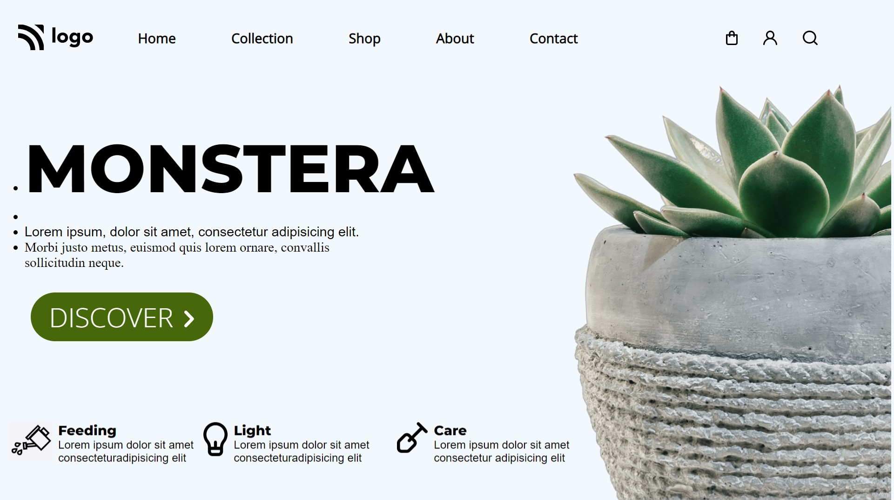

# Plants Website Landing Page  

## Languages used in this project
- HTML
- CSS

## Preview of this project

***

# About Me
> My name is **Jaydatt Ramkabir** currently i am learning full stack web development

## What i learned while building project ?
- ### HTML
    - `button`
    - `div`
    - `ul`
    - `li`
    - `h1`
    - `h4`
    - `p`
    - Many More...
- ### CSS
    - Positions
    - Pseudo Codes
    - Playing With Parent and Child Tags of HTML
    - Many More...

## How much time taken to build this ? 
>3 Hours
